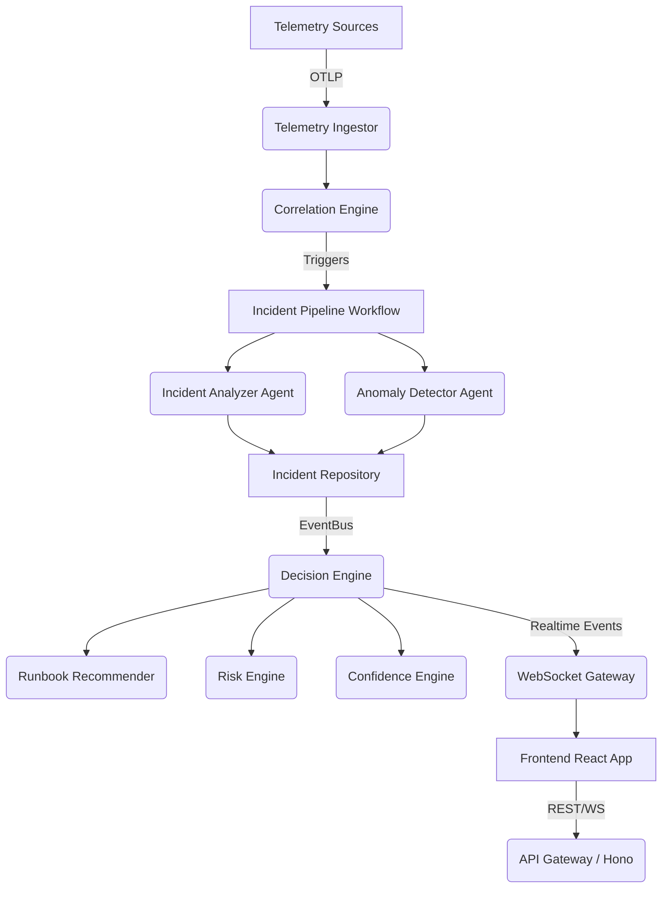

# SentinelFlow Architecture

SentinelFlow is an Autonomous AI SRE Platform designed to automatically ingest telemetry, analyze incidents, compute risk and confidence, recommend runbooks, and provide an interactive AI assistant.

## High-Level Architecture

## Backend Components

1. **Mastra Workflows**: `IncidentPipelineWorkflow` and `IncidentWorkflow` orchestrate the agent actions.
2. **EventBus**: A centralized publisher/subscriber model. `@EventHandler('EventName')` decorators allow decoupled domain modules to react to lifecycle events.
3. **Intelligence Module**: Contains `DecisionEngine`, `RiskEngine`, `ConfidenceEngine`, `RunbookRecommender`. Computes autonomous remediation paths.
4. **Knowledge Module (Qdrant)**: Stores embeddings of past incidents and resolutions for similarity matching.
5. **Realtime Module**: Manages WebSocket connections and room-based broadcasting for multi-tenant frontend updates.

## Frontend Components

1. **React Foundation**: Vite + React 19 + TypeScript.
2. **State Management**: Zustand for global state, React Query for API data fetching and caching.
3. **UI Library**: shadcn/ui built on Radix primitives and Tailwind CSS. Framer Motion for micro-interactions.
4. **AI Assistant**: A floating interactive agent interface that queries the `/api/v1/assistant/chat` endpoint, backed by Mastra agents.
